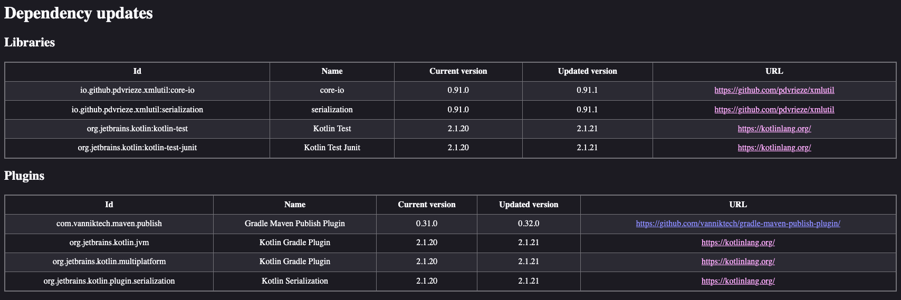
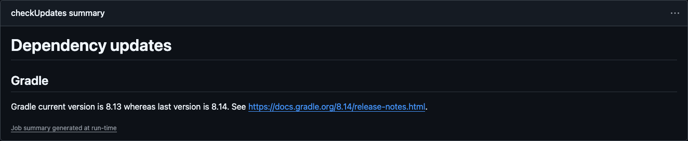
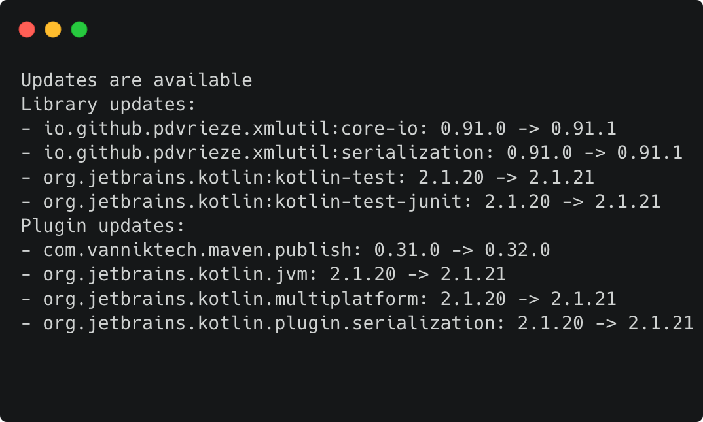

# Caupain

[\\kɔ.pɛ̃\\](https://ipa-reader.com/?text=%5Ck%C9%94.p%C9%9B%CC%83%5C&voice=Celine)

*Your best buddy for keeping versions catalogs up to date!*

## What's this ?

**Caupain** is a tool to help you keep your Gradle versions catalogs up to date.  It is fast, simple
to use, and provides a simple report to help you know what dependencies you need to update.

## Another one ?

Yeah, I know, there's [Dependabot](https://github.com/dependabot), [Renovate](https://www.mend.io/renovate/), 
[refreshVersions](https://splitties.github.io/refreshVersions/) or [gradle-version-plugins](https://github.com/ben-manes/gradle-versions-plugin)
(and probably many more), but Caupain aims to be simple, fast, and not too opinionated.

The main design choice that distinguishes Caupain from the others is that a simple choice has been made:
there's only one source of truth, which is the [version catalog](https://docs.gradle.org/current/userguide/version_catalogs.html),
and it only handles Maven repositories.

By not plugging itself into Gradle, it avoids the long runtime that comes with having to wait for Gradle
resolving the dependencies. It also doesn't force you to do anything, nor changes anything by itself: 
it only tells you what the new versions are and where to find info, and lets you deal with the info.

Basically, if you want a tool that's fast and simple to generate an update report for you, then Caupain 
will be your best buddy !

## Ok, I'm sold, how do I use it ?

There are two ways to use Caupain: either as a [command line tool](cli/README.md), or as a 
[Gradle plugin](gradle-plugin/README.md). See each README for more details.

## What does the reports look like ?

Caupain can generate reports in the following formats:
- **HTML**: a simple HTML report that you can open in your browser. It contains the list of updates 
alongside with infos about them

- **Markdown**: a simple Markdown report that you can use in a Github summary action for example. This
very repository actually uses it for its own dependencies updates

- **Console**: a simple console report listing the updates.

- **JSON**: a JSON report that you can use in your own scripts or tools.

## Why the name ?

"Copain" is a French word that means "buddy" or "pal". It also means **CA**talog **UP**d**A**te **IN**dexer, 
but honestly that's only to be serious.